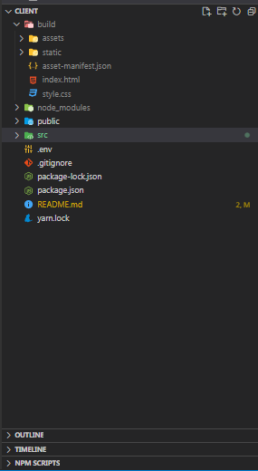
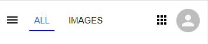
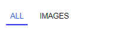
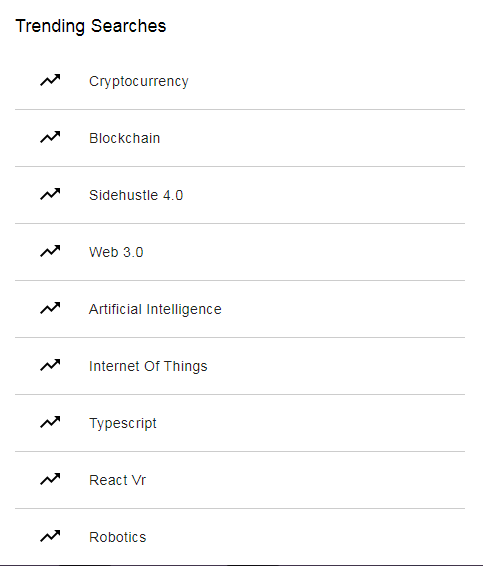

## Table of contents

- [Overview](#Overview)
  - [Description](#Description)
  - [Requirements](#Requirements)
  - [Installing Dependencies](#Installing-Dependencies)
  - [Project Structure](#Project-Structure)
  - [Links](#Links)
  - [The process](#The-process)
   - [Built with](#Built-with)
   - [Third Party Packages](#Third-Party-Packages)
   - [Version Control](#Version-Control)
   - [Hosting](#Hosting)
  - [Team Members](#Team-Members)
- [Acknowledgments](#Acknowledgments)

# Overview

## Description

This Project is A Solution To The Capstone Project Given By Sidehustle [React Track] For Week 2

> Built By [Team Greyjoy]

## Requirements

- Use React Js
- Provide a useable experience across all modern web browsers and users who require
  assistive technologies .
- Recreate the Google homepage ( Google )
- Replace the Google Logo with SideHustle logo
- When a user types in the search input field, update the SideHustle logo to the value in
  the input field.
- When the input field is empty, display the logo again
- Document your code and publish a write-up on hashnode or medium as a team on your
  experience so far learning React JS and in Side Hustle Internship so far.
- Host your project on Vercel or Netlify
- Submit Article Link, Github link and live Link

## Installing Dependencies

> If You download the repo code / clone the repo, you will need to run
> _npm install_ in the project directory to install any project dependencies first. Without doing this, the code may not work as
> expected.

## Project Structure

This project was bootstrapped with [Create React App](https://github.com/facebook/create-react-app).

As With All Projects Created With CRA The Folder Structure is Very Similar To The Boilerplate React Gives



The Public Folder Contains The Index.html and Style.css Which is use To Style The Page, while The Src Folder Consists Of The two folders

Assets Folder (Where The Sidehustle Logo and other images used in this Project resides.)

And The Components Folder which contains Reuseable components Used throughout the App

> Our Entry File The App.js Looks Like This, it is a Stateless functional components which Returns The Components Used in The main Page.

```jsx
> App.js

import Navigation from "./component/Navigation";
import Content from "./component/Content";
import Trend from "./component/Trend";
import Footer from "./component/Footer";
import "./App.css";

function App() {
  return (
    <div className="App">
      <Navigation />
      <Content />
      <Trend />
      <Footer />
    </div>
  );
}

export default App;

```

Taking Them One At a Time
<br>
<br>

# Navigation Component

This is a Stateless Functional Component Which Gets Rendered Differently Based On The Device Screen Width, it is responsible for rendering the Navigation.

> Desktop Version


> Mobile Version



A Bit Of The Css Responsible For It, definitely dive into the source code to have an indepth view

```css
@media (min-width: 645px) {
  .Navigation {
    display: none;
  }
  .Navigation_desktop {
    display: flex;
    justify-content: flex-end;
    align-items: center;
    padding-top: 0.9rem;
    top: 0;
    left: 0;
    background-color: white;
    position: sticky;
    padding-bottom: 20px;
    z-index: 10000;
  }

  ....;
}
```

# Option Component

A Simple Function For Rendering The Option In The Navigation, it also indicate the Active Option, it Receives Two Props name and active. The active prop is Used for styling The Option differently to show it is active.



```jsx
> Option.js

import React from "react";

export default function Option({ name, active }) {
  return (
    <span className={`option__name hoverBtn ${active ? active : ""}`}>
      {name}
    </span>
  );
}

```

# Content Component

This is a Stateful Functional Component. it Basically Consists Of The Logo, The SearchBar (Another Custom Component), Buttons (from the Material Icons) And The Google Offers content


```jsx

> Content.js

import React, { useState } from "react";
import { Button } from "@material-ui/core";
import logo from "../assets/logo-dark.64d45129.png";
import SearchBar from "./SearchBar";

export default function Content() {
  const [name, setName] = useState("");

  const colorArr = [
    "yellow",
    "blue",
    "green",
    "red",
    "purple",
    "cyan",
    "magenta",
  ];
  const handleChange = (e) => setName(e.target.value);

  return (
    <div className="content">
      <div className="content__logo">
        {name.length > 0 ? (
          <div className="content__text">
            {name.split("").map((c, i) => (
              <span
                key={c + i}
                style={{
                  color: colorArr[Math.ceil(Math.random() * colorArr.length)],
                }}
              >
                {c}
              </span>
            ))}
          </div>
        ) : (
          
        )}
      </div>
      <div className="content__searchBar">
        <SearchBar onHandleChange={handleChange} />
      </div>
      <div className="content__buttons">
        <Button>Google Search</Button>
        <Button>I'm Feeling Lucky</Button>
      </div>
      <div className="content__offering">
        <span>Google Offered In:</span>
        <div className="content__language">
          <span>Hausa</span>
          <span>Igbo</span>
          <span>Ede Yoruba</span>
          <span>Nigerian Pidgin</span>
        </div>
      </div>
    </div>
  );
}
```

> The HandleChange function is responsible for setting The State to each value the user Inputs, it is triggered From The input in the [SearchBar.js Component](#searchbar), when ever a User Types

```jsx
const [name, setName] = useState("");
....
const handleChange = (e) => setName(e.target.value);
....
```

> Here is the Snippet Of Code Responsible For Optionally Rendering The Logo Or text,Depending on The input text Length

```jsx

> Content.js

 <div className="content__logo">
        {name.length > 0 ? (
          <div className="content__text">
            {name.split("").map((c, i) => (
              <span
                key={c + i}
                style={{
                  color: colorArr[Math.ceil(Math.random() * colorArr.length)],
                }}
              >
                {c}
              </span>
            ))}
          </div>
        ) : (
          
        )}
      </div>
```

The text will be displayed if The length of the text is greater Than 0 else if No Text is entered i.e (if the text length is 0 or lesser) The Logo Will be Displayed.

i added a bit of styling to the text displayed, by adding a split method on the name which basically returns an array i.e

```jsx
`hello'.split('')
> ['h', 'e', 'l', 'l', 'o']
```

i then map over each item in the returned array and for each item a span containing the key and style attribute is provided, the value given to the style attribute looks like this

```jsx
style={{
  color: colorArr[Math.ceil(Math.random() * colorArr.length)],
}}
```

This is just a Fancy way of Randomly Pulling out an element of The colorArr.

```jsx
const colorArr = [
  "yellow",
  "blue",
  "green",
  "red",
  "purple",
  "cyan",
  "magenta",
];
```

# SearchBar Component

A Stateless Functional Component, it is Responsible For Rendering The Input Component Of The App, it raises an Event called onHandleChange whenever the text entered by the User changes, it gets Handled in the [Content.js](#content)

```jsx
> SearchBar.js


import { Mic, Search } from "@material-ui/icons";
import React from "react";

export default function SearchBar({ onHandleChange }) {
  return (
    <div className="searchBar">
      <Search />
      <input
        type="text"
        placeholder="Search Sidehustle or type a URL"
        onChange={onHandleChange}
      />
      <Mic />
    </div>
  );
}

```

# Trend Component

A Stateful Functional Component, Responsible For Rendering The Trends in The App. it is displayed optionally on Smaller Screens. it basically maps over an array i.e trendArr and returns a trend. The Trending Up Icon is gotten from MUI (TrendingUp)



```jsx
import { Button } from "@material-ui/core";
import { TrendingUp } from "@material-ui/icons";
import React from "react";

export default function Trend() {
  const trendArr = [
    "Cryptocurrency",
    "Blockchain",
    "Sidehustle 4.0",
    "Web 3.0",
    "Artificial Intelligence",
    "Internet Of Things",
    "Typescript",
    "React Vr",
    "Robotics",
  ];

  const displayTrends = () =>
    trendArr.map((trend) => (
      <div className="trend__trend" key={trend}>
        <div className="trend__left">
          <TrendingUp />
        </div>
        <div className="trend__right">
          <Button>{trend}</Button>
        </div>
      </div>
    ));

  return (
    <div className="trend__container">
      <div className="trend__title">Trending Searches</div>

      <div className="trend__trends">{displayTrends()}</div>
    </div>
  );
}
```

# Footer Component

A Stateless Functional Component, Responsible For Rendering The Footer Of The App, a bit of Responsive Styling And Flexbox Was Used To Make it Adjust To different Screen Width


```jsx
import React from "react";

export default function Footer() {
  return (
    <div className="footer">
      <div className="footer__country hover">Nigeria</div>
      <hr />
      <div className="footer__options">
        <div className="footer__option">
          <span className="hoverBtn">Settings</span>
          <span className="hoverBtn">Privacy</span>
          <span className="hoverBtn">Terms</span>
        </div>
        <div className="footer__option">
          <span className="hoverBtn">Advertising</span>
          <span className="hoverBtn">Business</span>
          <span className="hoverBtn">About</span>
        </div>
      </div>
    </div>
  );
}
```

### Links

- Link To Live Site [Landing Site](https://sidehustle-landpage.netlify.app/)

## The process

### Built with

- React Js
- CSS custom properties
- Flexbox
- CSS Grid
- Material-Ui
- Mobile-first workflow

### Coding Convention

- BEM Naming convention
- All components Are named Using The Pascal Naming Convention
- Best coding Practices Were followed

### Third Party Packages

- Material UI

### Version Control

- Github

### Hosting

- The project is hosted on Netlify

## Team Members:

- [Solomon (Team Lead)](https://github.com/OdebisiidowuSolomon)
- [Montso Matlaletsa](https://github.com/Montso-Matlaletsa)
- [IdrisDY](https://github.com/idrisDy)
- [Oriola Okiki](https://github.com/okikioriola1)
- [faozziyyah](https://github.com/faozziyyah)
- [Shewardelujo](https://github.com/Shewardelujo)
- Excel Chimdindu
- Oliver Kennedy

## Acknowledgments

We Would Really Like To thank Sidehustle Internship Team For The Opportunity to Grow and Learn At The Same Time,
We would Also Love To Say a Big Thank To Our Mentor Realice For A Providing Great Project like This To Work On!
